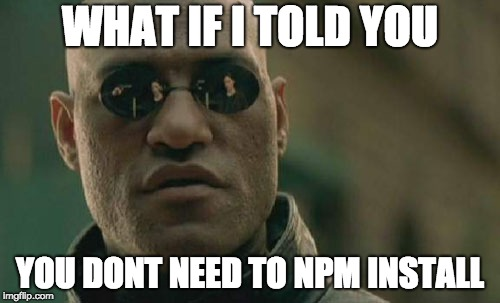

1. DON'T `npm install`.

2. Do you have Docker? If not, go a head and install it. Go [here](https://docs.docker.com/engine/installation/) for details.

3. Get the dev server running with `yarn start` (or `npm start`).

###### Questions? Contact hayden.braxton.dev@gmail.com
